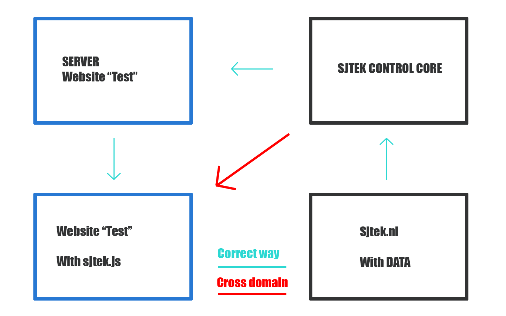

#Sjtek.js & Bootstrap/Vue.js prototype

Dit is de repository van Kevin Grond die de bestanden bevat voor de M41 matchmaker prototype en de vernieuwde Sjtek Library
## Sjtek.js
Sjtek js is een javascript library waar een grote collectie aan functies in staat die het mogelijk maakt om aspecten van ons huis te bedienen. De huidige versie werkt helaas alleen als je het ook host via onze eigen server vanwege een aantal issues met het ophalen van de data uit de sjtek JSON. Het is namelijk zo dat je niet zomaar cross domain data kan ophalen met de nieuwe Fetch funtie van JS. Hieronder een kleine illustratie.

## Matchmaker prototype
De matchmaker prototype is gemaakt samen met bootstrap en het Vue.js framework. Ik heb gekozen voor deze 2 frameworks vanwege de snelle en makkelijke toepassing. Iets wat erg belangrijk is bij het maken en testen van deze soort prototypes. De prototypes waren hierbij voornamelijk bedoelt om de globale layout te testen en de daadwerkelijke stellingen die we zouden gebruiken. De proto slaat geen data op maar presenteert deze aan de user aan de hand van de data uit een JSON. Deze JSON kon ik makkelijk editen zodat we snel dingen konden toevoegen of veranderen aan de stellingen. 

Vue.js is een manier om een Model-View-Controller model toe te passen op het product. Hiermee kunnen we makkelijk en dynamisch de stellingen inladen en tonen aan de testpersoon. Een MVC werkt via een Model, Controller, View en user. Deze spelen elk hun specifieke rol.

